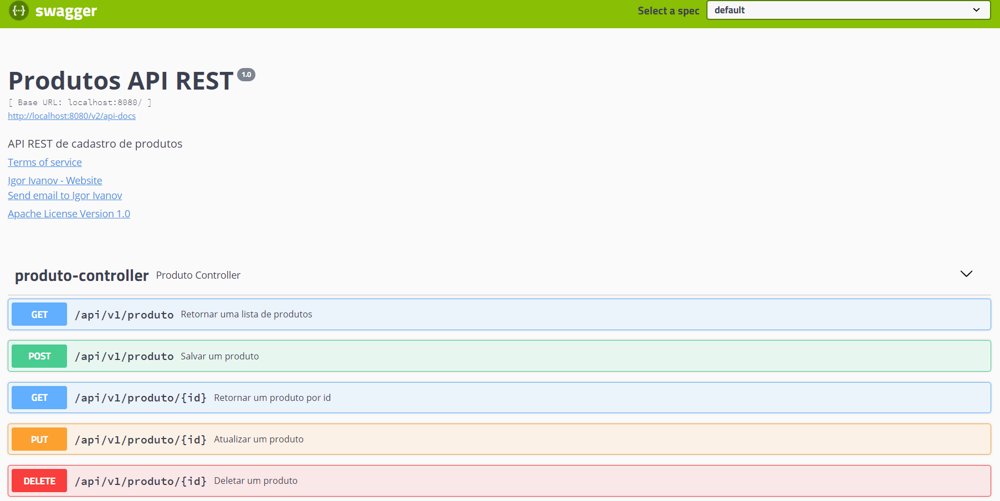

<h1 align="center"> Gerenciador de produtos API </h1>

  

 

## Projeto

Com objetivo de estudar e praticar criação de API REST, desenvolvi um projeto para gerenciamento de produtos de uma determinada loja de roupas, uma estrutura CRUD com os principais métodos HTTP.

 

## Tecnologias

Esse projeto foi desenvolvido com as seguintes tecnologias:

- Java
- Spring Boot Web
- Spring Boot MVC
- Spring Boot JPA com MySQL 
- Requisições via Postman
- Gerênciador de dependências Mavem
- Swagger para documentação da API

